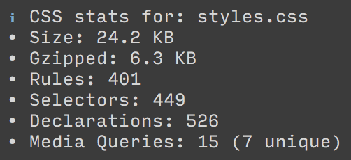

# postcss-stats-reporter [](https://travis-ci.org/jeffjewiss/postcss-stats-reporter)

Print your stats from `cssstats` as a plugin (no additional build code required).

Installation
------------

```
npm install postcss-stats-reporter
```


Usage
-----

Just drop this plugin in after the `cssstats` postcss plugin:

```javascript
postcss([
  cssstats(),
  statsReporter()
])
```

Example Output
--------------


